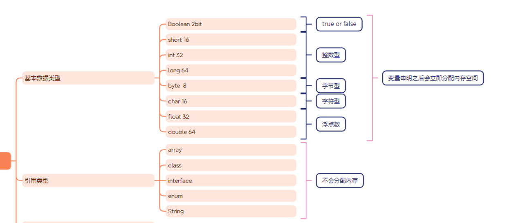
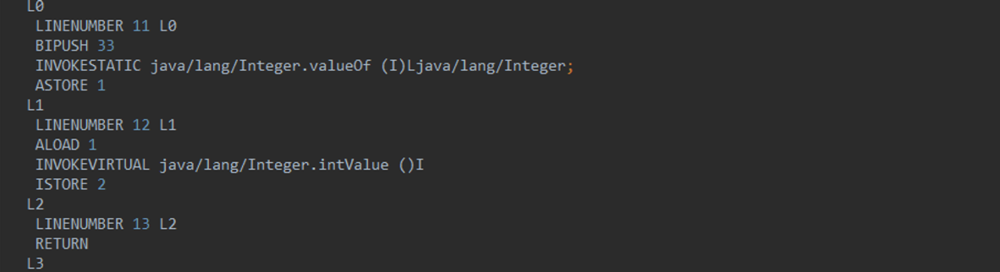
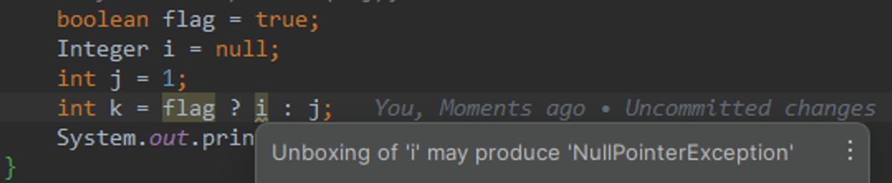
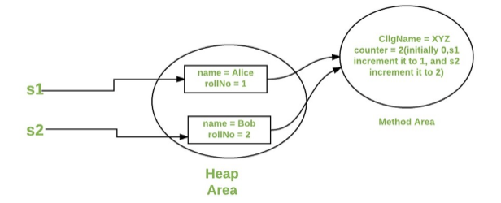

## 数据类型



### 基本数据类型

| 基本类型 | 位数 | 字节 | 默认值  | 取值范围                                   |
| -------- | ---- | ---- | ------- | ------------------------------------------ |
| byte     | 8    | 1    | 0       | -128 ~ 127                                 |
| short    | 16   | 2    | 0       | -32768 ~ 32767                             |
| int      | 32   | 4    | 0       | -2147483648 ~ 2147483647                   |
| long     | 64   | 8    | 0L      | -9223372036854775808 ~ 9223372036854775807 |
| char     | 16   | 2    | 'u0000' | 0 ~ 65535                                  |
| float    | 32   | 4    | 0f      | 1.4E-45 ~ 3.4028235E38                     |
| double   | 64   | 8    | 0d      | 4.9E-324 ~ 1.7976931348623157E308          |
| boolean  | 1    |      | false   | true、false                                |

### 浮点数

#### 浮点数得精度运算

无限循环的小数存储在计算机中，多余的只能截断

```bash
        float a = 2.0f-1.0f;
        float b= 1.8f-1.7f;
        System.out.println(a == b);
output:false
```

- 解决精度丢失
- BigDecimal

```bash
        BigDecimal c = new BigDecimal("1.0");
        BigDecimal d = new BigDecimal("0.9");
        System.out.println(c.subtract(d));
```
java 中 Long 是最大的正数类型 64 位
超过则使用 BigInteger 内部使用 int[]数组存储任意大小的整形数据

#### BigDecimal

实现对浮点数的运算不会造成精度丢失
优先推荐入参为 String 的构造方法，或者 BigDecimal.valueof(double)，double 的 toString 会按照 double 的实际能表达的精度对尾数截断

```java
        BigDecimal bigDecimal = new BigDecimal(0.1F);
        System.out.println("bigDecimal = " + bigDecimal);
        BigDecimal bigDecimal1 = new BigDecimal("0.1");
        System.out.println("bigDecimal1 = " + bigDecimal1);
        BigDecimal bigDecimal2 = BigDecimal.valueOf(0.1f);
        System.out.println("bigDecimal2 = " + bigDecimal2);
bigDecimal = 0.100000001490116119384765625
bigDecimal1 = 0.1
bigDecimal2 = 0.10000000149011612
```

```java
    public static BigDecimal valueOf(double val) {
        // Reminder: a zero double returns '0.0', so we cannot fastpath
        // to use the constant ZERO.  This might be important enough to
        // justify a factory approach, a cache, or a few private
        // constants, later.
        return new BigDecimal(Double.toString(val));
    }
```

#### 大小比较

`a.compareTo(b)`: 返回 -1 表示`a`小于`b`，0 表示`a`等于`b`， 1 表示`a`大于`b`。

`BigDecimal a = new BigDecimal("1.0");
BigDecimal b = new BigDecimal("0.9");
System.out.println(a.compareTo(b));// 1`

#### 等值比较

应该使用 compareto 而不是 equals

```java
public class Demo2 {
    public static void main(String[] args) {
        BigDecimal bigDecimal = new BigDecimal("1");
        BigDecimal bigDecimal1 = new BigDecimal("1.0");
        System.out.println(bigDecimal1.equals(bigDecimal));
        System.out.println(bigDecimal1.compareTo(bigDecimal));
    }
}

false
0
```

```java
@Override
    public boolean equals(Object x) {
        if (!(x instanceof BigDecimal))
            return false;
        BigDecimal xDec = (BigDecimal) x;
        if (x == this)
            return true;
        if (scale != xDec.scale)
            return false;
        long s = this.intCompact;
        long xs = xDec.intCompact;
        if (s != INFLATED) {
            if (xs == INFLATED)
                xs = compactValFor(xDec.intVal);
            return xs == s;
        } else if (xs != INFLATED)
            return xs == compactValFor(this.intVal);

        return this.inflated().equals(xDec.inflated());
    }
```

### 自动转换

- 由小数据转换为大数据的时候会发生自动转换
  (byte，short，char) < int < long < float < double
- 整型类型和浮点型进行计算后，结果会转为浮点类型

```java
long x = 30;
float y = 14.3f;
System.out.println("x/y = " + x/y);
x/y = 1.9607843
```

> “大”与“小”，并不是指占用字节的多少，而是指表示值的范围的大小
> 可见 long 虽然精度大于 float 类型，但是结果为浮点数类型

- 转换前后的数据类型要兼容
  由于 boolean 类型只能存放 true 或 false，这与整数或字符是不兼容的，因此不可以做类型转换。

### 强制转换

强制转换使用括号 () 。
引用类型也可以使用强制转换

```JAVA
float f = 25.5f;
int x = (int)f;
System.out.println("x = " + x);
```

### 包装类

基本类型都有对应的包装类型，基本类型与其对应的包装类型之间的赋值使用自动装箱与拆箱完成。

```java
Integer x = 2;     // 装箱
int y = x;         // 拆箱
```

- new Integer(123) 每次都会新建一个对象
- Integer.valueOf(123) 会使用缓存池中的对象，多次调用会取得同一个对象的引用。

```java
Integer a= new Integer(123);
Integer b = new Integer(123);
System.out.println(a == b);    // false
Integer c = Integer.valueOf(123);
Integer d = Integer.valueOf(123);
System.out.println(c == d);   // true
```

编译器会**在缓冲池范围内的基本类型**自动装箱过程调用 valueOf() 方法，因此多个 Integer 实例使用自动装箱来创建并且值相同，那么就会引用相同的对象

```java
public static Integer valueOf(int i) {
        if (i >= IntegerCache.low && i <= IntegerCache.high)
            return IntegerCache.cache[i + (-IntegerCache.low)];
        return new Integer(i);
    }
    private static class IntegerCache {
        static final int low = -128;
        static final int high;
        static final Integer cache[];
        static {
            // high value may be configured by property
            int h = 127;
            String integerCacheHighPropValue =
                sun.misc.VM.getSavedProperty("java.lang.Integer.IntegerCache.high");
            if (integerCacheHighPropValue != null) {
                try {
                    int i = parseInt(integerCacheHighPropValue);
                    i = Math.max(i, 127);
                    // Maximum array size is Integer.MAX_VALUE
                    h = Math.min(i, Integer.MAX_VALUE - (-low) -1);
                } catch( NumberFormatException nfe) {
                    // If the property cannot be parsed into an int, ignore it.
                }
            }
            high = h;
            cache = new Integer[(high - low) + 1];
            int j = low;
            for(int k = 0; k < cache.length; k++)
                cache[k] = new Integer(j++);

            // range [-128, 127] must be interned (JLS7 5.1.7)
            assert IntegerCache.high >= 127;
        }
        private IntegerCache() {}
    }
```

基本类型对应的缓冲池如下:
- boolean values true and false
- all byte values
- short values between -128 and 127
- int values between -128 and 127
- char in the range \u0000 to \u007F

### 基本数据和包装类

- 基本类型占用的空间更小
- 基本类型不赋值有默认值，而包装类型不赋值默认为 null
- 基本类型存储在栈中，包装类型存储在堆中
  - Java 中的基本类型（如**`int`**、**`float`**、**`double`**、**`boolean`**等）通常存储在栈内存中。这是因为基本类型的值直接存储在使用它们的方法的栈帧中。基本类型的值是直接按值传递的，它们的生命周期通常随着方法的调用而开始，随着方法的返回而结束
  - 另一方面，包装类型（如**`Integer`**、**`Float`**、**`Double`**、**`Boolean`**等）是基本类型的对象表示形式，它们用于 Java 集合框架中，以及在需要对象而非基本类型的其他情况下。由于包装类型是对象，它们的实例存储在堆内存中。当创建一个包装类型的实例时（例如通过** `new Integer(5)`**），就会在堆内存中分配空间来存储这个对象，而对象的引用则可以存储在栈内存中（如果它是一个局部变量）。
- 无论是基本类型还是引用类型的成员变量，如果它们是对象的非**`static`**成员，那么这些成员变量的数据都存储在堆内存中的。
  - static 变量是存储在方法区的

### 自动装箱和拆箱

基本数据类型与包装类的转换被称为装箱和拆箱。
装箱（boxing）是将值类型转换为引用类型。例如：int 转 Integer。
拆箱（unboxing）是将引用类型转换为值类型。例如：Integer 转 int

```java
        Integer c1 = 33;//装箱
        int c2 = c1;//拆箱
```



从字节码中，我们发现装箱其实就是调用了 包装类的 `valueOf()`方法，拆箱其实就是调用了 `xxxValue()`方法。

### scene

- **场景一、将基本数据类型放入集合类**

Java 中的集合类只能接收对象类型

```java
List<Integer> li = new ArrayList<>();
 for (int i = 1; i < 50; i ++){
    li.add(i);
    }

 反编译
         List<Integer> li = new ArrayList<>();
        for (int i = 1; i < 50; i++) {
            li.add(Integer.valueOf(i));
        }
```

- **场景二、包装类型和基本类型的大小比较**

对 Integer 对象与基本类型

```java
        Integer a=1;
        System.out.println(a==1?"等于":"不等于");
        Boolean bool=false;
        System.out.println(bool?"真":"假");
 ----------------------------------------------------
         Integer a = 1;
        System.out.println(a.intValue() == 1 ? "等于" : "不等于");
        Boolean bool = false;
        System.out.println(bool.booleanValue() ? "真" : "假");
```

包装类与基本数据类型进行比较运算，是先将包装类进行拆箱成基本数据类型，然后进行比较的。

- **场景三、包装类型的运算**

对 Integer 对象进行四则运算

```java
Integer i = 10; Integer j = 20; System.out.println(i+j);
--------------------------------------------------------
        Integer i2 = 10;
        Integer j = 20;
        System.out.println(i2.intValue() + j.intValue());
```

两个包装类型之间的运算，会被自动拆箱成基本类型进行。

- **场景四、三目运算符的使用**

```java
boolean flag = true;
Integer i = 0;
 int j = 1;
 int k = flag ? i : j;
--------------------------------------------------------
        Integer i = 0;
        int k = 1 != 0 ? i.intValue() : 1;
        System.out.println(k);
```

这是三目运算符的语法规范：当第二，第三位操作数分别为基本类型和对象时，其中的对象就会拆箱为基本类型进行操作。

因为例子中，flag ? i : j;片段中，第二段的 i 是一个包装类型的对象，而第三段的 j 是一个基本类型，所以会对包装类进行自动拆箱。如果这个时候 i 的值为 null，那么就会发生 NPE。



### 引用类型

- class
- enum
- interface
- array

## String

```java
public final class String
    implements java.io.Serializable, Comparable<String>, CharSequence {
    /** The value is used for character storage. */
    private final char value[];
}
```

### String 的不可变

private final char value[];

对字符串的截取、拼接等操作都是重新生成了新的字符串对象
给一个已有字符串第二次赋值，不是在原内存地址修改数据，而是一个新的对象（新地址）


- 保存字符串的字符数组是 final 并且私有的 没有提供/暴露修改这个字符串的方法
- 类被 final 修饰 防止子类破坏 String 不可变

1. value 不可变 是 value 这个引用地址不可变 但是 Array 数组是可变的
2. value 只是 stack 上的一个引用，数组是在堆上，堆里数组本身数据是可变的

```java
public class ArrayChangeDemo {
    public static void main(String[] args) {
        final int[] value = {1,2,3};
        int[] anotherValue = {4,5,6};
//        value =anotherValue;
        value[2]=6;
        System.out.println(value[2]);
    }
}

6
```

### 不可变的好处

- 线程安全 多个线程可以安全的共享 String 对象
- String 作为参数传递给方法时，不会因为方法内部对 String 的修改而导致外部产生意外的结果。

```java
package com.jasper.StringDemo;

public class ChangeDemo {
    public static void main(String[] args) {
                String myString = "Hello";
                printString(myString);
                // 在调用方法后，我们期望myString保持不变
                System.out.println("After method call: " + myString);
            }
public static void printString(String str) {
        str = "asd";
        System.out.println(str);
        }
}
asd
After method call: Hello
```

- String 被广泛用作哈希表的键，因为其不可变性保证了哈希码的稳定性，保证哈希值不会频繁的变更
  使用 Stringbuilder 破坏了 hashSet 的唯一性

```java
package com.jasper.StringDemo;

import java.util.HashSet;

public class BuilderDemo {
    public static void main(String[] args) {
        HashSet<StringBuilder> hs = new HashSet<>();
        StringBuilder a = new StringBuilder("a");
        StringBuilder ab = new StringBuilder("ab");
        hs.add(a);
        hs.add(ab);
        System.out.println(hs);
        StringBuilder s = a;
        s.append("b");
        System.out.println(hs);
    }
}
output：
[ab, a]
[ab, ab]
```

### 字符串常量池

jdk8 以后存储在堆中
JVM 为了针对字符串提升性能和减少内存消耗开辟的一块区域，避免字符串的重复创建

```java
package com.jasper.StringDemo.stringdemo;

public class Demo3 {
    public static void main(String[] args) {
        String a = "aa";
        String b = "aa";
        System.out.println(a == b);
    }
}
output:true
```

当我们创建一个字符串常量时，它会存储在字符串常量池中，只创建一个对象。
当我们创建一个字符串对象时，如果字符串对象的内容是一个已经存在在字符串常量池中的字符串，
那么这个对象会指向已经存在的字符串常量，而不会创建一个新的字符串常量

### intern

- 直接使用双引号声明出来的 `String`对象会直接存储在常量池中。
- 如果不是用双引号声明的 `String`对象，可以使用 `String`提供的 `intern`方法。intern 方法会从字符串常量池中查询当前字符串是否存在，若不存在就会将当前字符串放入常量池中

```java
package com.jasper.StringDemo.stringdemo;
public class Demo3 {
    public static void main(String[] args) {
        String  s1 = new String("abc");
        String s2 = s1.intern();
        System.out.println(s1 == s2);
        String s3 = new String("a")+new String("b");
        String s4 = s3.intern();
        System.out.println(s3 == s4);
    }
}
false
true
```

s1 是在堆中的引用
s2 是在 string pool 中
创建了三个字符串对象： **`"a"`**、**`"b"`** 和 **`"ab"`**。
s3 是 stringbuilder.append 拼接的 最后 toString，这个新的字符串 "ab" 并不会直接放入字符串池，因为它是通过操作创建的，而不是直接使用字符串字面量
在这里，**`s3`** 的值为 "ab"，并且这个字符串并没有在池中
对 s3 执行 `intern()` 方法，该方法会从字符串常量池中查找“ab”这个对象是否存在，此时不存在的，但堆中已经存在了，所以字符串常量池中保存的是堆中这个“ab”对象的引用，也就是说，s3 和 s4 的引用地址是相同的，所以输出的结果为 true

### stringbuilder and stringbuffer

- 每次对 String 类型进行改变的时候，都会生成一个新的 String 对象
- `StringBuffer` 每次都会对 `StringBuffer` 对象本身进行操作，而不是生成新的对象并改变对象引用
- 使用 `StringBuilder` 相比使用 `StringBuffer` 能获得性能提升，但却要冒多线程不安全的风险

1. 少量数据 String
2. 单线程大量数据 StringBuilder
3. 多线程大量数据 StringBuffer

### 字符串的拼接

字符串通过+的方式拼接，本质是通过 StringBuilder 调用 append 方法实现的，拼接完之后会调用 toString 方法得到一个字符串对象


## 操作符

### 原码 反码 补码

todo

### java 中的位运算

在 Java 中，位运算符直接对整数类型的操作数的二进制位进行操作。以下是 Java 中常用的位运算符：

1. **按位与（AND）`&`**: 对两个数的每一位进行逻辑与操作。只有在两个相应位都是 1 时，结果才是 1，否则是 0。

```java
int a = 60; // 60 = 0011 1100
int b = 13; // 13 = 0000 1101
int c = a & b; // c = 12 = 0000 1100
```

2. **按位或（OR）`|`**: 对两个数的每一位进行逻辑或操作。只要有一个相应位是 1，结果就是 1。

```java
int a = 60; // 60 = 0011 1100
int b = 13; // 13 = 0000 1101
int c = a | b; // c = 61 = 0011 1101
```

3. **按位异或（XOR）`^`**: 对两个数的每一位进行逻辑异或操作。如果两个相应位值相同，则结果为 0，否则为 1。

```java
int a = 60; // 60 = 0011 1100
int b = 13; // 13 = 0000 1101
int c = a ^ b; // c = 49 = 0011 0001
```

4. **按位取反（NOT）`~`**: 对一个数的每一位进行取反操作。即 1 变为 0，0 变为 1。

```java
int a = 60; // 60 = 0011 1100
int c = ~a; // c = -61 = 1100 0011 (in two's complement form)
```

5. **左移位 `<<`**: 将操作数的二进制表示向左移动指定的位数，从右边补 0。

```java
int a = 3; // 3 = 0000 0011
int c = a << 2; // c = 12 = 0000 1100
```

6. **右移位 `>>`**: 将操作数的二进制表示向右移动指定的位数。对于正数，从左边补 0，对于负数，从左边补 1。

```java
int a = -8; // -8 = 1111 1000 (in two's complement form)
int c = a >> 2; // c = -2 = 1111 1110 (in two's complement form)
```

7. **无符号右移 `>>>`**: 将操作数的二进制表示向右移动指定的位数，从左边补 0。和有符号右移不同，无论正负都从左边补 0。

```java
int a = -8; // -8 = 1111 1000 (in two's complement form)
int c = a >>> 2; // c = 1073741822 = 0011 1111 1111 1111 1111 1110
```

位运算在底层编程、图形处理、加密算法等领域非常有用。它们的操作速度快，因为处理器直接在硬件级别上对位进行操作。但是，位运算的代码可读性比较差，因此在不追求极致性能的普通应用程序开发中使用较少。在使用时，应确保清楚地注释代码，以提高其可维护性。

## 关键字

### static

the static keyword in java is mainly used for memory management.The static keyword in java is used to share the same variable or method of a given class.

The users can apply static keyword with variables,methods,blocks,and **nested（嵌套的）** classes.

The static keyword belongs to the class than an instance of the class.

The static keyword is used for a **constant(n 常量 adj 不变的）** variable or a method that is the same for every instance of a class

For

- variable
- blocks
- methods
- classes

#### member

when a member is declared static,it can be accessed before any objects of its class are created

and without reference to any object

```java
class Test
    {
        static void m1(){
        "from m1".sout
            }

        main{
            m1();
        }
    }
```

#### static block

if you need to do the computation in order to initialize your static variables,you can declare a static block that gets executed(执行 实施） exactly once, when the class is first loaded

```java
class Test{
 static int a = 10;
    static int b;
    static{
        "static block initialized".sout
            b = a* 4;
    }
    main{
        a.sout;
        b.sout;
    }
}
```

#### static variable

当将变量声明为静态时，则在类级别的所有对象之间创建并共享该变量的单个副本。 静态变量基本上是\*\*（（（本质的）全局变量。类的所有实例共享相同的静态变量。

important points for static variables:

- we can create static variables at the class level only

```java
public class Test3 {
    public static void main(String[] args) {
        System.out.println(fun());
    }

    static int fun(){
        static int x = 10; //Error static local variable are not allow
        return  x--;
    }
}
```

In java, a static variable is a class variable(for whole calss) so if we have static

**local（局部的 当地的 本地的）** variable(a variable with scope limited to function) it **violates(违反 违背**） the purpose of static. hence compiled does not allow static local variable.

- static block and static variables are executed in the order they are present in a program

```java
public class Test2 {
    static int a  = m1();

    static {
        System.out.println("inside static block");
    }

    static int m1(){
        System.out.println("from m1");
        return 20;
    }

    public static void main(String[] args) {
        System.out.println("from main");
        System.out.println(a);
    }
}
```

#### static methods

当用静态关键字声明方法时，它是 konwn 作为静态方法。静态方法的最常见示例是 main（）方法。

如上所述，可以在创建其类的任何对象并且不参考任何对象之前访问任何静态成员。被声明为静态的方法具有 Servel 限制：

- 他们只能直接调用其他静态方法
- 他们只能直接访问静态数据
  - 静态方法是属于类的，而不是类的某个特定对象实例。因此，在静态方法的执行过程中，没有 this 引用，这意味着它们无法直接访问实例变量或实例方法
  - 静态成员（包括静态变量和静态方法）在类被加载到 JVM 时就已经存在，而不需要创建类的任何对象实例。这就意味着静态方法可以在没有任何对象实例存在的情况下被调用。如果静态方法被允许访问非静态成员，那么在**没有实例化对象的情况下，这些非静态成员根本就不存在**，从而可能导致运行时错误
- They cannot refer to this or super in any way

```java
package Static;

public class Test4 {
    static int a = 10;

    int b =10;
    void m2(){
        System.out.println("from m2");
    }
    static void m1(){
        a = 20;
        System.out.println("from m1");
//        b = 20;  cannot make a static reference to the non-static field;
//        m2(); cannot make a static reference to the non-static method m2()
//        System.out.println(super.a);
    }
}
```

#### static classes

只有当它是嵌套类（内类）时，才能使一个类成为静态

我们无法用静态修饰符声明顶级类，但可以将嵌套类声明为静态类。类型的类称为嵌套静态类。固定的静态类不需要外部类的引用。 在这种情况下（（案例）（案例）（案例）\*\*），静态类无法访问外部类的非静态成员。

Java 允许在另一个类中定义类。这些类别称为嵌套的 Calsses。类别可以是静态的，
作为内部类；
如果没有外部类的实例，就无法创建内部类的实例，因此内部类实例可以访问其外部类的所有成员，而无需使用对外部类实例的参考。出于此原因，内部类可以 帮助使程序简单简洁；
**可以在不实例化外部类的情况下实例化静态嵌套类。**

```java
package Static;

public class StaticNestedClass {
    private static String str = "this is jasper";

    static class NestedClass{
        public void disp(){
            System.out.println(str);
        }
    }

    public static void main(String[] args) {
        NestedClass nestedClass = new NestedClass();
        nestedClass.disp();
    }
}
```

### 初始化顺序

静态变量和静态语句块优先于实例变量和普通语句块，静态变量和静态语句块的初始化顺序取决于它们在代码中的顺序。
存在继承的情况下，初始化顺序为:

1. 加载父类的静态内容：首先加载并初始化父类的静态变量和静态代码块，静态内容只在类首次加载到 JVM 时初始化一次。
2. 加载子类的静态内容：接着加载并初始化子类的静态变量和静态代码块，同样，这些静态内容只初始化一次。
3. 初始化父类的实例变量和普通语句块：当通过构造函数创建对象的实例时，首先初始化父类的实例变量和普通（非静态）初始化块。
4. 执行父类的构造函数：执行父类的构造函数，完成父类的构建。
5. 初始化子类的实例变量和普通语句块：然后初始化子类的实例变量和普通初始化块。
6. 执行子类的构造函数：最后，执行子类的构造函数，完成子类对象的创建。

### when to use static variavble and methods

为所有对象共有的属性使用静态变量。例如，在班级学生中，所有学生共享相同的大学名称，使用静态方法来更改静态变量；

```java
package Static;

public class Student {
    String name;
    int id;
    static String collegeName;
    static int counter = 0;

    public Student(String name) {
        this.name = name;
        this.id=setid();
    }

    static int setid(){
        counter++;
        return counter;
    }

    static void setCollegeName(String name){
        collegeName = name;
    }

    void getStudentInfo(){
        System.out.println("name:" + this.name);
        System.out.println("id:" + this.id);
        System.out.println("collegeName:" + collegeName);
    }

    public static void main(String[] args) {
        Student.setCollegeName("xupt");
        Student jasper = new Student("jasper");
        Student cliff = new Student("cliff");
        jasper.getStudentInfo();
        cliff.getStudentInfo();
    }
}
```



## Q&A

short s1 = 1; s1 = s1 + 1;有错吗?short s1 = 1; s1 += 1;有错吗
对于 short s1 = 1; s1 = s1 + 1;由于 1 是 int 类型，因此 s1+1 运算结果也是 int 型，需要强制转换类型才能赋值给 short 型。
`在Java中，所有的整数计算至少会自动提升到 int 类型`
而 short s1 = 1; s1 += 1;可以正确编译，因为 s1+= 1;相当于 s1 = (short(s1 + 1);其中有隐含的强制类型转换。
`复合赋值运算符会自动进行类型转换`
