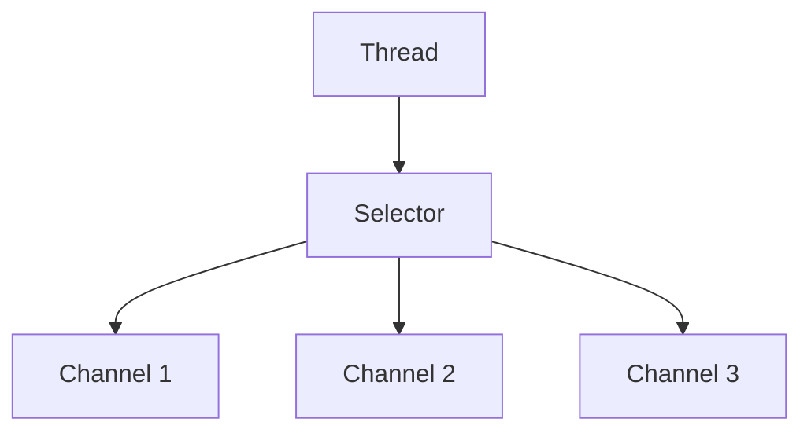

# IO
- InputStream/Reader: 所有的输入流的基类，前者是字节输入流，后者是字符输入流。
- OutputStream/Writer: 所有输出流的基类，前者是字节输出流，后者是字符输出流。
## File
``` java
package com.jasper.file;

import java.io.FileInputStream;
import java.io.FileOutputStream;
import java.io.IOException;

public class ByteDemo {
    public static void main(String[] args) {
        try(FileInputStream fileInputStream = new FileInputStream
                ("C:\\code\\javaBasic\\IO\\src\\main\\java\\com\\jasper\\file\\test.png");
            FileOutputStream fileOutputStream = new FileOutputStream
                    ("C:\\code\\javaBasic\\IO\\src\\main\\java\\com\\jasper\\file\\testCopy.png")

        ) {
            int byteValue;
            while ((byteValue = fileInputStream.read())!=-1){
                fileOutputStream.write(byteValue);
            }
        } catch (IOException e) {
            e.printStackTrace();
        }
    }
}

```
``` java
package com.jasper.file;

import java.io.FileNotFoundException;
import java.io.FileReader;
import java.io.FileWriter;
import java.io.IOException;

public class CharDemo {
    public static void main(String[] args) {
        try (FileReader
                     fileReader = new FileReader("C:\\code\\javaBasic\\IO\\src\\main\\java\\com\\jasper\\file\\source.txt");
             FileWriter fileWriter = new FileWriter("C:\\code\\javaBasic\\IO\\src\\main\\java\\com\\jasper\\file\\destination.txt");
        ){
            int byteValue;
            while ((byteValue = fileReader.read())!= -1){
                fileWriter.write(byteValue);
            }
        } catch (IOException e) {
            throw new RuntimeException(e);
        }
    }
}

```
## buffed
ava中的缓冲输入输出流主要是通过BufferedInputStream和BufferedOutputStream类来实现的。这些流类包装了其他类型的输入输出流（如文件流FileInputStream和FileOutputStream），
提供了缓冲功能，以增强文件读写操作的效率和性能。缓冲流通过减少实际的物理读写次数来提高IO操作的效率，因为直接对磁盘的读写操作相比内存操作要慢得多
``` java
package com.jasper.file;
import java.io.*;
public class BufferByteDemo {
    public static void main(String[] args) {
        try(FileInputStream fileInputStream = new FileInputStream
                ("C:\\code\\javaBasic\\IO\\src\\main\\java\\com\\jasper\\file\\test.png");
            FileOutputStream fileOutputStream = new FileOutputStream
                    ("C:\\code\\javaBasic\\IO\\src\\main\\java\\com\\jasper\\file\\testCopy.png");
            BufferedInputStream bufferedInputStream = new BufferedInputStream(fileInputStream);
            BufferedOutputStream bufferedOutputStream = new BufferedOutputStream(fileOutputStream)
        ) {
            int byteData;
            while ((byteData = bufferedInputStream.read()) != -1) {
                bufferedOutputStream.write(byteData);
            }
        } catch (IOException e) {
            e.printStackTrace();
        }
    }
}


package com.jasper.file;
import java.io.*;
public class BufferCharDemo {
    public static void main(String[] args) {
        try (FileReader
                     fileReader = new FileReader("C:\\code\\javaBasic\\IO\\src\\main\\java\\com\\jasper\\file\\source.txt");
             FileWriter fileWriter = new FileWriter("C:\\code\\javaBasic\\IO\\src\\main\\java\\com\\jasper\\file\\destination.txt");
             BufferedReader bufferedReader = new BufferedReader(fileReader);
             BufferedWriter bufferedWriter = new BufferedWriter(fileWriter)
        ){
            String line;
         while ((line =  bufferedReader.readLine())!= null){
             bufferedWriter.write(line);
         }
        } catch (IOException e) {
            throw new RuntimeException(e);
        }
    }
}

```

## 基本数据类型
`DataInputStream` 和 `DataOutputStream` 是 Java I/O 库中用于读写基本数据类型（如 `int`、`long`、`float`、`double`、`String` 等）的两个类。
它们提供了一种便捷的方式来处理数据流中的基本数据类型和字符串，而无需手动将这些类型转换为字节或从字节转换回来。

### DataInputStream
`DataInputStream` 允许应用程序以便携方式从底层输入流中读取基本 Java 数据类型。
它通常与 `FileInputStream` 配合使用，但也可以用于任何类型的输入流，如 `ByteArrayInputStream`。

#### 基本使用
``` java
package com.jasper.data;

import java.io.*;

public class Demo {
    public static void main(String[] args) throws Exception {
        FileOutputStream fileOutputStream = new FileOutputStream("C:\\code\\javaBasic\\IO\\src\\main\\java\\com\\jasper\\data\\input.txt");
        DataInputStream dataInputStream = getDataInputStream(fileOutputStream);
        System.out.println(dataInputStream.readInt());
        System.out.println(dataInputStream.readInt());
        System.out.println(dataInputStream.readDouble());
        System.out.println(dataInputStream.readBoolean());

    }

    private static DataInputStream getDataInputStream(FileOutputStream fileOutputStream) throws IOException {
        DataOutputStream dataOutputStream = new DataOutputStream(fileOutputStream);
        dataOutputStream.writeInt(2);
        dataOutputStream.writeInt(3);
        dataOutputStream.writeDouble(2.0);
        dataOutputStream.writeBoolean(false);
        dataOutputStream.flush();
        dataOutputStream.close();
        FileInputStream fileInputStream = new FileInputStream("C:\\code\\javaBasic\\IO\\src\\main\\java\\com\\jasper\\data\\input.txt");
        DataInputStream dataInputStream = new DataInputStream(fileInputStream);
        return dataInputStream;
    }
}

```

### 注意事项
- 当使用 `DataOutputStream` 写入数据时，应确保使用与之兼容的 `DataInputStream` 进行读取，以保证数据的正确性和类型匹配。
- `DataInputStream` 和 `DataOutputStream` 操作的是二进制数据，因此写入的数据不是人类可读的文本格式。如果需要查看或编辑生成的文件，需要使用专门的工具或程序进行解析。
- 这些类非常适合于数据序列化的简单场景。然而，对于复杂的对象图或需要跨不同 Java 虚拟机实例交换的数据，考虑使用 Java 的对象序列化机制可能更为合适。

## 序列化
Java中的序列化是一种将对象的状态保存为一系列字节的过程，这些字节可以被存储到磁盘上或通过网络传输到另一个系统。反序列化是序列化的逆过程，它将这些字节转换回原来的对象。Java序列化对于对象的持久化存储和远程方法调用（如在RMI中）尤其重要。

### 实现序列化

要使Java中的一个对象可序列化，其类必须实现`java.io.Serializable`接口。`Serializable`是一个标记接口，不包含方法，其唯一的作用是允许类的对象被序列化。

``` java
import java.io.Serializable;

public class User implements Serializable {
    private static final long serialVersionUID = 1L;

    private String name;
    private transient int age; // 使用transient关键字标记的字段不会被序列化

    // 构造函数、getter和setter省略
}
```

### 序列化和反序列化

使用`ObjectOutputStream`类可以将一个实现了`Serializable`接口的对象序列化到文件中。相应地，可以使用`ObjectInputStream`类从文件中反序列化对象。

#### 序列化示例

``` java
User user = new User();
user.setName("Java");
user.setAge(25);

try (FileOutputStream fileOut = new FileOutputStream("/tmp/user.ser");
     ObjectOutputStream out = new ObjectOutputStream(fileOut)) {
    out.writeObject(user);
} catch (IOException i) {
    i.printStackTrace();
}
```

#### 反序列化示例

``` java
User user = null;
try (FileInputStream fileIn = new FileInputStream("/tmp/user.ser");
     ObjectInputStream in = new ObjectInputStream(fileIn)) {
    user = (User) in.readObject();
} catch (IOException i) {
    i.printStackTrace();
    return;
} catch (ClassNotFoundException c) {
    System.out.println("User class not found");
    c.printStackTrace();
    return;
}

System.out.println("Name: " + user.getName());
System.out.println("Age: " + user.getAge());
```

### 注意事项

1. **`serialVersionUID`**：每个可序列化的类都建议显式声明`serialVersionUID`字段。这个字段用于验证序列化对象的发送方和接收方是否加载了与序列化兼容的类。
2. **`transient`关键字**：如果不希望某个字段被序列化，可以使用`transient`关键字标记这个字段。被`transient`修饰的字段在序列化过程中会被忽略。
3. **安全性**：序列化也引入了潜在的安全问题，因为攻击者可能通过篡改序列化的数据来攻击系统。因此，需要谨慎处理反序列化操作，尤其是处理来自不受信任源的数据。

## 打印流
在Java中，打印流提供了一种方便的方式来输出文本数据。这些流主要通过`PrintStream`和`PrintWriter`类实现，它们都继承自`java.io.OutputStream`和`java.io.Writer`类，分别用于字节流和字符流的输出。这两个类提供了一系列的`print()`和`println()`方法，用于输出各种数据类型（如`int`、`long`、`float`、`double`、`char`、`String`等）的值，而不需要转换为字节或字符。

### PrintStream

`PrintStream`是输出流的一种，最典型的用法是`System.out`，它是`PrintStream`的一个实例，用于向标准输出（通常是控制台）写入数据。

``` java
System.out.println("Hello, World!");
int number = 123;
System.out.println(number);
```

`PrintStream`提供了多种构造器，可以包装其他类型的输出流，例如`FileOutputStream`，从而可以很容易地将数据写入文件。

``` java
try (PrintStream out = new PrintStream(new FileOutputStream("output.txt"))) {
    out.println("Hello, file!");
} catch (FileNotFoundException e) {
    e.printStackTrace();
}
```

### PrintWriter

`PrintWriter`与`PrintStream`类似，但`PrintWriter`是基于字符的。它更适合写入文本数据，尤其是当需要考虑到国际化（处理不同的字符集）时。`PrintWriter`也提供了`print()`和`println()`方法。

``` java
try (PrintWriter writer = new PrintWriter(new FileWriter("output.txt"))) {
    writer.println("Hello, PrintWriter!");
} catch (IOException e) {
    e.printStackTrace();
}
```

与`PrintStream`一样，`PrintWriter`可以包装各种输出流和写入器（Writer），包括文件流（`FileOutputStream`、`FileWriter`）和网络流等。

### 区别和选择

- **处理异常**：`PrintStream`方法不抛出`IOException`，而`PrintWriter`的某些构造器允许设置自动刷新功能，在这种模式下，如果发生I/O错误，客户端可以通过检查`checkError()`方法的返回值来响应错误。对于`PrintWriter`，如果使用了不自动刷新的构造器，则需要手动管理异常。
- **字符编码**：`PrintWriter`支持字符编码，而`PrintStream`使用平台默认的字符编码，这在处理需要特定字符集的国际化文本时非常重要。
- **性能**：对于写入字符数据，`PrintWriter`可能比`PrintStream`更高效，因为它直接处理字符，避免了字符到字节的转换开销。

根据需要输出的数据类型（字节或字符）以及是否需要处理国际化文本，可以选择使用`PrintStream`或`PrintWriter`。
## 随机访问流
在Java中，随机访问文件是通过`RandomAccessFile`类实现的。
这个类支持对文件的随机访问，可以在文件中的任何位置读取或写入数据。
这意味着你不需要从文件开始依次读取到特定位置，而是可以直接跳到感兴趣的部分。
这对于需要频繁寻找特定位置的应用来说非常有用，如数据库的实现。

`RandomAccessFile`同时实现了`DataInput`和`DataOutput`接口，这使得它既可以读取也可以写入各种基本类型的数据
（如`int`、`double`、`String`等），并且以机器独立的方式。

### 访问模式

要使用`RandomAccessFile`，你需要指定文件路径和访问模式。
是的，`RandomAccessFile`类在Java中支持四种不同的访问模式，这些模式定义了文件如何被打开以及如何进行读写操作。这些模式对于控制文件数据的一致性和完整性特别重要，尤其是在面对系统崩溃或电源故障等情况时。以下是四种模式的简要说明：

### 1. "r" - 只读模式
- 在这个模式下，你只能从文件中读取数据，不能写入新数据。
- 尝试进行写操作会抛出`IOException`。

### 2. "rw" - 读写模式
- 允许对文件进行读取和写入操作。
- 文件的内容可以被修改，如果文件不存在，则会创建一个新文件。

### 3. "rws" - 同步读写模式
- 除了提供"rw"模式的所有功能外，"rws"模式确保每个对文件内容或元数据的更新都同步到底层存储设备。
- 这意味着每次写操作都会同步写入存储设备，确保数据的一致性和耐久性，即使在操作系统崩溃或电源故障的情况下。

### 4. "rwd" - 同步读写模式（仅数据）
- 类似于"rws"模式，但"rwd"模式仅确保对文件内容的更新（而不包括元数据）被同步到存储设备。
- 这个模式适用于需要确保数据一致性但不需要元数据（如文件权限或修改时间）同步更新的情况。

### 使用场景
- **"r"模式**适用于只需要从文件中读取数据的场景。
- **"rw"模式**适用于需要读取文件数据并可能更新文件内容的场景。
- **"rws"和"rwd"模式**适用于需要高数据一致性的场景，比如数据库文件操作，这些模式通过确保写操作直接同步到物理存储设备，减少了数据丢失的风险。

选择正确的访问模式对于应用程序的性能和数据完整性至关重要。"rws"和"rwd"模式虽然提供了更高的数据安全性，但由于同步操作的开销，它们可能会比"rw"模式有更低的性能。

``` java
package com.jasper.random;
import java.io.File;
import java.io.FileNotFoundException;
import java.io.IOException;
import java.io.RandomAccessFile;
import java.util.RandomAccess;
public class Demo {
    public static void main(String[] args) throws IOException {
        RandomAccessFile rws = new RandomAccessFile(
                new File("C:\\code\\javaBasic\\IO\\src\\main\\java\\com\\jasper\\random\\input.txt"), "rws");
        System.out.println("读取之前的指针位置："+rws.getFilePointer()+"读取的内容："+(char)rws.read()+"读取之后的指针位置"+rws.getFilePointer());
        rws.seek(6);
        System.out.println("读取之前的指针位置："+rws.getFilePointer()+"读取的内容："+(char)rws.read()+"读取之后的指针位置"+rws.getFilePointer());
        rws.write(new byte[]{'h','i','j','k'});
        rws.seek(0);
        System.out.println("读取之前的指针位置："+rws.getFilePointer()+"读取的内容："+(char)rws.read()+"读取之后的指针位置"+rws.getFilePointer());
        rws.seek(0);
        int content;
        while ((content = rws.read())!=-1){
            System.out.print((char) content);
        }
    }
}

```

### 应用场景

`RandomAccessFile`非常适合于需要随机访问或修改文件的场景，如：

- 文件的内容需要频繁更新或修改。
- 需要读取文件的某个特定部分。
- 实现数据库索引和其他数据结构，这些结构需要在文件中随机存取数据。

尽管`RandomAccessFile`非常强大，但在处理大型文件或需要高效读写操作的应用中，可能需要考虑其他IO选项，如NIO（New IO），它提供了更高效的IO操作方式。

## java中的IO模型
Java中的IO（输入/输出）模型主要包括两大类：阻塞IO（BIO）和非阻塞IO（NIO）。随着Java的发展，这两种模型已经被扩展和增强，特别是非阻塞IO，它发展出了NIO（New IO）、NIO.2（也称为AIO，异步IO）等。下面是对这些模型的简要介绍：

### 1. BIO - 阻塞IO
- BIO是Java早期模型，以流（Stream）的方式处理数据，其中数据读取或写入的每个操作都是阻塞的。例如，如果一个线程从网络中读取数据，它会一直等待直到数据到达。
- BIO适合连接数较少且固定的应用架构，但在高并发环境下性能不佳，因为每个连接都需要独立的线程来处理。

### 2. NIO - 非阻塞IO
- NIO引入了通道（Channel）、缓冲区（Buffer）和选择器（Selector）的概念，支持非阻塞的数据读写操作和多路复用技术。
- NIO可以让**一个线程管理多个输入和输出通道**，**通过单个线程轮询访问所管理的所有通道**，检查哪些通道准备好了可以进行数据的读写，从而提高系统资源的利用率和吞吐量。
- NIO广泛用于网络服务器开发中，特别是需要处理成千上万个客户端连接的场景。

### 3. NIO.2 / AIO - 异步IO
- 在Java 7中引入，NIO.2增加了对异步文件IO和网络IO的支持，即AIO。
- AIO实现了真正的异步非阻塞IO操作。在AIO模型中，IO操作会立即返回，不会阻塞线程，而是在IO操作完成时通过回调函数通知应用程序。
- AIO适用于连接数多，但单个连接数据交互不是很频繁，处理大量并发连接但每个连接IO操作不是特别密集的应用场景。

### 模型选择
- **BIO**：适合连接数目比较小且固定的应用，例如传统的客户端-服务器应用。
- **NIO**：适合需要使用非阻塞方式处理成千上万个连接的场景，比如高性能服务器。
- **AIO**：适合IO操作非常耗时的应用，可以显著减少线程资源的占用。

## NIO
### 通道

通道 Channel 是对原 I/O 包中的流的模拟，可以通过它读取和写入数据

- FileChannel：用于文件的数据读写。不支持非阻塞模式。
- DatagramChannel：可以通过UDP读写网络中的数据。
- SocketChannel：可以通过TCP读写网络中的数据，支持非阻塞模式。
- ServerSocketChannel：可以监听新进来的TCP连接，像Web服务器那样。对每一个新进来的连接都会创建一个SocketChannel。

### 缓冲区
给通道发送或者接受数据都得先放到缓冲区中
缓冲区本质是一个数组 提供了对数据的结构化访问，而且还可以跟进系统的读写进程
在Java NIO中，缓冲区（Buffer）是一个对象，用于存储数据。当使用NIO进行I/O操作时，你总是先将数据读入到一个缓冲区，或者从一个缓冲区写出数据。缓冲区实质上是一个可以读写数据的内存块，可以被视为一个容器对象，这使得缓冲区成为数据传输的核心。

#### 缓冲区的主要特性

- **容量（Capacity）**：缓冲区能够容纳的数据元素的最大数量。在缓冲区创建时被设定且不可改变。
- **限制（Limit）**：缓冲区的第一个不能被读或写的数据的索引。**即位于limit后的数据不能被读写**。Limit可以被设置且小于等于capacity。
- **位置（Position）**：下一个要被读或写的元素的索引。Position会自动由相应的get()和put()函数更新。
- **标记（Mark）**：一个备忘位置。可以通过mark()方法设定mark = position，通过reset()方法设定position = mark。标记在设定前是未定义的(undefined)。

#### 缓冲区的类型

Java NIO 提供了以下类型的缓冲区，每种类型的缓冲区都管理着其对应的基本类型元素的固定长度列表：

- **ByteBuffer**：字节缓冲区，最常用的类型。
- **CharBuffer**：字符缓冲区。
- **ShortBuffer**：短整型缓冲区。
- **IntBuffer**：整型缓冲区。
- **LongBuffer**：长整型缓冲区。
- **FloatBuffer**：浮点型缓冲区。
- **DoubleBuffer**：双精度浮点型缓冲区。

#### 缓冲区的基本操作

1. **分配（Allocate）**：给缓冲区分配指定容量的空间。
   ```java
   ByteBuffer buffer = ByteBuffer.allocate(10); // 分配一个容量为10的ByteBuffer
   ```

2. **写入数据（Put）**：将数据写入缓冲区。
   ``` java
   buffer.put((byte) 123); // 写入一个字节
   ```

3. **翻转（Flip）**：从写模式切换到读模式。
   ``` java
   buffer.flip(); // 切换模式，准备读取刚刚写入的数据
   ```

4. **读取数据（Get）**：从缓冲区读取数据。
   ``` java
   byte b = buffer.get(); // 读取一个字节
   ```

5. **重绕（Rewind）**：将position设回0，可以重新读取缓冲区中的所有数据。
   ``` java
   buffer.rewind();
   ```

6. **清空（Clear）**：清空缓冲区，为再次写入数据做准备。
   ``` java
   buffer.clear(); // 清空缓冲区。注意：数据并未被清除，只是位置被重置
   ```

通过这些操作，缓冲区在Java NIO中扮演着数据容器的角色，使得数据处理变得更加高效和灵活。

``` java
package com.jasper.nio;

import java.io.IOException;
import java.io.RandomAccessFile;
import java.nio.ByteBuffer;
import java.nio.channels.FileChannel;

public class FileChannelExample {
    public static void main(String[] args) throws IOException {
        RandomAccessFile file = new RandomAccessFile("C:\\code\\javaBasic\\IO\\src\\main\\java\\com\\jasper\\nio\\data.txt", "rw");
        FileChannel channel = file.getChannel();
        ByteBuffer buffer = ByteBuffer.allocate(48);
        int read = channel.read(buffer);
        System.out.println("read = " + read);
        while (read != -1){
            buffer.flip();

            while (buffer.hasRemaining()){
                System.out.print((char) buffer.get());
            }
            buffer.clear();
        }
        file.close();
    }
}
```
``` java title="NIO copy file demo" 
package com.jasper.nio;

import java.io.*;
import java.nio.ByteBuffer;
import java.nio.channels.FileChannel;

public class NIOCopyFileDemo {
    public static void main(String[] args) throws IOException {
        FileInputStream fileInputStream = new FileInputStream("C:\\code\\javaBasic\\IO\\src\\main\\java\\com\\jasper\\nio\\data.txt");
        FileChannel fci = fileInputStream.getChannel();
        FileOutputStream fileOutputStream = new FileOutputStream("C:\\code\\javaBasic\\IO\\src\\main\\java\\com\\jasper\\nio\\output.txt");
        FileChannel fco = fileOutputStream.getChannel();

        ByteBuffer buffer = ByteBuffer.allocate(1024);
        //将读取的数据写到缓冲区
        int read = fci.read(buffer); //此时position = read
        while (read != -1) {
            buffer.flip(); // 准备读取数据    limit设置为当前position position = 0
            fco.write(buffer); // 写入数据
            while (buffer.hasRemaining()){
                System.out.print((char) buffer.get());
            }
            buffer.clear();
        }
        fileInputStream.close();
        fileOutputStream.close();

    }
}

```

### 选择器
NIO 实现了 IO 多路复用中的 Reactor 模型，**一个线程 Thread 使用一个选择器 Selector 通过轮询的方式去监听多个通道 Channel 上的事件**，
从而让一个线程就可以处理多个事件。通过配置监听的通道 Channel 为非阻塞，那么当 Channel 上的 IO 事件还未到达时，就不会进入阻塞状态一直等待，
而是继续轮询其它 Channel，找到 IO 事件已经到达的 Channel 执行
一个线程来处理多个事件

非阻塞模式的适用场景：
网络I/O：在处理网络I/O时，非阻塞模式非常有用，因为网络操作可能会由于各种原因（如网络延迟、对方应用程序处理缓慢等）导致数据不可用。在这种情况下，非阻塞模式允许程序执行其他任务，而不是无休止地等待数据到达。
多路复用I/O：通过使用选择器（Selector）和非阻塞通道（如SocketChannel），一个单独的线程可以管理多个网络连接，这对于需要处理成千上万个网络连接的高性能网络服务器尤其重要。
Java NIO的选择器（Selector）是Java NIO中的一个高级组件，用于检查一个或多个NIO通道（Channel），并确定哪些通道准备好了进行读取、写入或连接。选择器使用单个线程来管理多个通道，这是非阻塞I/O的基础，允许你的程序更加高效地使用系统资源。

#### 核心知识点概述：

1. **多路复用**：
   选择器可以同时监控多个通道的I/O状态，这被称为I/O多路复用。这样，单个线程可以管理多个并发的数据传输。

2. **通道注册**：
   通道必须是非阻塞的才能注册到选择器。这通常涉及到`SelectableChannel`的子类，如`SocketChannel`或`ServerSocketChannel`。

3. **选择键**：
   当通道注册到选择器时，选择器会返回一个`SelectionKey`对象。这个对象代表了注册到该选择器的通道。`SelectionKey`包含了兴趣集合，
4. 即当前通道感兴趣的操作集合，如读（OP_READ）、写（OP_WRITE）、连接（OP_CONNECT）和接受（OP_ACCEPT）。

4. **选择操作**：
   选择器通过其`select()`方法检查注册的通道，如果某个通道准备好了进行注册时指定的操作，就会被选择器选中。`select()`方法返回值表示有多少通道已准备好。

5. **选择集**：
   被选中的通道集合可以通过选择键集来访问，有三种类型：
   - **keys()**：所有注册到该选择器的通道的选择键集合。
   - **selectedKeys()**：准备好至少一个注册操作的通道的选择键集合。
   - **cancelledKeys()**：已取消的键，即将被注销的通道的集合。

6. **阻塞与非阻塞模式**：
   `select()`方法有阻塞和非阻塞两种模式。阻塞模式会等待至少一个通道准备好，而非阻塞模式（`selectNow()`）会立即返回，不管是否有通道准备好。

7. **唤醒选择器**：
   可以通过`wakeup()`方法来唤醒阻塞在`select()`方法上的选择器。这是一个线程安全的方法，可以从其他线程中调用。

### 使用选择器的步骤：

1. **打开选择器**：
   ``` java
   Selector selector = Selector.open();
   ```

2. **注册通道**：
   ``` java
   channel.configureBlocking(false);
   SelectionKey key = channel.register(selector, SelectionKey.OP_READ);
   ```

3. **选择就绪的通道**：
   ``` java
   int readyChannels = selector.select();
   if (readyChannels == 0) continue;
   ```

4. **处理就绪的通道**：
   ``` java
   Set<SelectionKey> selectedKeys = selector.selectedKeys();
   Iterator<SelectionKey> keyIterator = selectedKeys.iterator();
   while (keyIterator.hasNext()) {
       SelectionKey key = keyIterator.next();
       if (key.isAcceptable()) {
           // a connection was accepted by a ServerSocketChannel.
       } else if (key.isConnectable()) {
           // a connection was established with a remote server.
       } else if (key.isReadable()) {
           // a channel is ready for reading
       } else if (key.isWritable()) {
           // a channel is ready for writing
       }
       keyIterator.remove();
   }
   ```

5. **关闭选择器**
   关闭选择器同时会关闭所有注册到该选择器的通道。
   ``` java
   selector.close();
   ```

使用选择器时应该注意的是，选择键的`interest set`是动态的，可以随时改变，但是必须在对应的通道注册到某个选择器之后。此外，选择器本身是安全的，但是大量的I/O操作和选择键集的迭代操作并不是线程安全的，因此需要小心同步。

选择器是实现高性能网络服务器的关键，它允许服务器使用较少的线程来处理大量的并发连接。

## 异步IO
在Java中，异步I/O（AIO）是从Java 7开始引入的，作为新的I/O API（也称为NIO 2.0）。这一套API在`java.nio.channels`包下，通过它，Java程序可以非阻塞地执行I/O操作，同时继续处理其他任务，直到I/O操作完成。Java的异步I/O主要围绕以下几个核心类和接口展开：

### 核心类和接口

- **AsynchronousFileChannel**：用于文件I/O操作的异步通道。
- **AsynchronousSocketChannel**和**AsynchronousServerSocketChannel**：用于网络I/O操作的异步通道。
- **CompletionHandler**接口：当异步操作完成时，由系统回调的处理器。它有两个方法：`completed`（操作成功完成时调用）和`failed`（操作失败时调用）。

### 异步I/O操作的基本流程

1. **打开异步通道**：首先，需要打开一个异步通道（如`AsynchronousFileChannel`或`AsynchronousSocketChannel`）。

2. **发起异步操作**：通过异步通道的方法发起异步I/O操作。这些操作通常会立即返回，不会阻塞调用线程。

3. **处理结果**：异步操作可以通过两种方式处理结果：
   - **回调方式**：传递一个实现了`CompletionHandler`接口的对象。异步操作完成（无论成功还是失败）时，会调用相应的回调方法。
   - **Future方式**：异步操作会返回一个`Future`对象，通过它可以检查操作是否完成，等待操作完成，或者获取操作的结果。

### 示例：使用AsynchronousFileChannel读取文件

``` java
package com.jasper.AIO;

import java.io.IOException;
import java.nio.ByteBuffer;
import java.nio.channels.AsynchronousFileChannel;
import java.nio.channels.CompletionHandler;
import java.nio.file.Path;
import java.nio.file.Paths;
import java.nio.file.StandardOpenOption;

public class AsyncFileReadExample {
    public static void main(String[] args) throws IOException, InterruptedException {
        Path path = Paths.get("C:\\code\\javaBasic\\IO\\src\\main\\java\\com\\jasper\\AIO\\input.txt");
        try(AsynchronousFileChannel asynchronousFileChannel = AsynchronousFileChannel.open(path, StandardOpenOption.READ)){
            ByteBuffer buffer = ByteBuffer.allocate(1024);
            asynchronousFileChannel.read(buffer, 0, buffer, new CompletionHandler<Integer, ByteBuffer>() {
                @Override
                public void completed(Integer result, ByteBuffer attachment) {
                    try {
                        Thread.sleep(1000);
                    } catch (InterruptedException e) {
                        throw new RuntimeException(e);
                    }
                    System.out.println("Read done! Bytes read: " + result);
                    attachment.flip();
                    byte[] data = new byte[attachment.limit()];
                    attachment.get(data);
                    System.out.println(new String(data));
                    attachment.clear();
                }

                @Override
                public void failed(Throwable exc, ByteBuffer attachment) {
                    System.out.println("Read failed!");
                    exc.printStackTrace();
                }
            });
            System.out.println("haha");
            // 模拟其他任务执行
            Thread.sleep(2000); // 等待异步读取完成
            System.out.println("system exit");
        }
    }
}

```

在这个示例中，`AsynchronousFileChannel`用于异步读取文件内容。读取操作立即返回，并通过传入的`CompletionHandler`处理读取完成或失败的情况。

### 注意

- 异步I/O对于提高应用程序的响应性和吞吐量非常有帮助，特别是在处理大量并发I/O操作时。
- 使用异步I/O时，需要考虑回调逻辑的复杂性和错误处理。
- Java的异步I/O提供了与传统同步I/O相比更高级的控制，但实现起来可能更复杂。适当使用异步I/O可以显著提升性能，但也需要仔细设计程序逻辑，以避免常见的并发问题。