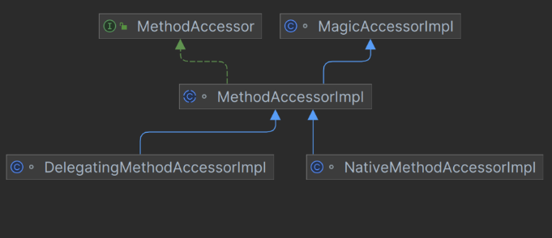

# 反射

一般我们在使用某个类之前就确定了是什么类，直接可以new来进行实例化来进行操作

反射就是一开始不知道要初始化的类，不能使用new来实例化

它允许在运行时检查和操作类、接口、字段和方法

框架的灵魂

通过反射你可以获取任意一个类的所有属性和方法，还可以调用这些方法

在spring springboot mybatis中都使用了

* jdk中的动态代理 [代理模式]()
* 注解   [annotation](./注解.md)

## 优点

* 代码更加灵活，为框架提供了便利通过配置文件来加载不同的对象，调用不同的方法
* 在运行时有了分析操作类的能力

## 缺点

* 破坏了封装，允许访问private method and param
* 增加了安全问题，无视泛型参数的检查
  * [泛型擦除](https://www.notion.so/a6c5e2af5b9e41c7b5d7d3be7ab4f1d1?pvs=21)
* 性能相对差一点

每一个类的实例都会对应一个Class对象，这个对象由jvm生成来获取整个类的结构信息

## Class

Class：代表一个类或接口，包含了类的结构信息（如名称、构造函数、方法、字段等）。通过 Class 对象，可以获取类的元数据并操作类的实例

```java
package com.jasper.reflection;

import java.lang.reflect.Constructor;
import java.lang.reflect.InvocationTargetException;
import java.lang.reflect.Method;

public class Demo1 {
    public static void main(String[] args) throws ClassNotFoundException, NoSuchMethodException, InvocationTargetException, InstantiationException, IllegalAccessException {
        Class<?> clazz = Class.forName("com.jasper.reflection.Person");
        Constructor<?> constructor = clazz.getConstructor();
        Object o = constructor.newInstance();
        Method setName = clazz.getMethod("setName", String.class);
        setName.invoke(o,"jasper");
        Method getName = clazz.getMethod("getName");
        System.out.println(getName.invoke(o));
    }
}
```

```java
jasper
```

```java
package com.jasper.reflection;

public class Person {
    private String name;
    private String age;

    public Person() {
    }

     private Person(String name, String age) {
        this.name = name;
        this.age = age;
    }

    public String getName() {
        return name;
    }

    public void setName(String name) {
        this.name = name;
    }

    public String getAge() {
        return age;
    }

    public void setAge(String age) {
        this.age = age;
    }

    public void print(){
        System.out.println("print method");
    }

    private void print(String name){
        System.out.println(name);
    }
}
```

## 获取反射类的Class对象

* Class.forName()  @param className the fully qualified name of the desired class.
  ```java
  @CallerSensitive
      public static Class<?> forName(String className)
                  throws ClassNotFoundException {
          Class<?> caller = Reflection.getCallerClass();
          return forName0(className, true, ClassLoader.getClassLoader(caller), caller);
      }
  ```
* 类名.class  适合在编译前就知道操作的Class
* 对象.getClass

```java
Class<?> clazz = Class.forName("com.jasper.reflection.Person");
        Class<Person> clazz1 = Person.class;
        Person person = new Person();
        Class<? extends Person> clazz2 = person.getClass();
        System.out.println(clazz == clazz1);
        System.out.println(clazz1 == clazz2);

```

* 类加载器(系统类加载器 应用类加载器）

```java
Class<?> clazz1 = ClassLoader.getSystemClassLoader().loadClass("com.jasper.reflection.Person");
```

## 创建反射类的对象

* Class对象的newInstance方法
* Constructor对象的newInstance method

```java
Object o = clazz.newInstance();
        Object o1 = clazz.getConstructor().newInstance();
        System.out.println(o);
        System.out.println(o1);
```

## 获取构造方法

``` java
//        Constructor<?> constructor = clazz.getConstructor(String.class, String.class);
//        System.out.println(constructor);
//        no param 无参constructor
        System.out.println(clazz.getConstructor());

//        include private and protected method
        Constructor<?> declaredConstructor = clazz.getDeclaredConstructor();
        System.out.println("declaredConstructor = " + declaredConstructor);
        Constructor<?> declaredConstructor1 = clazz.getDeclaredConstructor(String.class, String.class);
        System.out.println("declaredConstructor1 = " + declaredConstructor1);
//        get all public constructor
        Constructor<?>[] constructors = clazz.getConstructors();
        System.out.println("constructors = " + constructors);
//        get all constructor include private
        Constructor<?>[] declaredConstructors = clazz.getDeclaredConstructors();
        System.out.println("declaredConstructors = " + declaredConstructors);
```

## 获取字段

```java
Method setNameMethod = clazz.getMethod("setName", String.class);
Method getNameMethod = clazz.getMethod("getName");
```

## 获取方法

```java
Method print = clazz.getMethod("print");
        System.out.println("print = " + print);
        Method print1 = clazz.getDeclaredMethod("print", String.class);
        System.out.println("print1 = " + print1);
        print1.invoke(o,"jasper");
```

output

``` java
print = public void com.jasper.reflection.Person.print()
print1 = private void com.jasper.reflection.Person.print(java.lang.String)
Exception in thread "main" java.lang.IllegalAccessException: Class com.jasper.reflection.Demo2 can not access a member of class com.jasper.reflection.Person with modifiers "private"
	at sun.reflect.Reflection.ensureMemberAccess(Reflection.java:102)
	at java.lang.reflect.AccessibleObject.slowCheckMemberAccess(AccessibleObject.java:296)
	at java.lang.reflect.AccessibleObject.checkAccess(AccessibleObject.java:288)
	at java.lang.reflect.Method.invoke(Method.java:491)
	at com.jasper.reflection.Demo2.main(Demo2.java:42)
```

如果想反射访问私有字段和（构造）方法时，需要使用Constructor/field/method.setAccessible(true)

```java
Method print1 = clazz.getDeclaredMethod("print", String.class);
        System.out.println("print1 = " + print1);
        print1.setAccessible(true);
        print1.invoke(o,"jasper");
```

output

```java
print1 = private void com.jasper.reflection.Person.print(java.lang.String)
jasper
```

## invoke method


**`root`** 属性通常用于实现方法调用的优化。它用于维护 **`Method`** 对象之间的关联关系，特别是在涉及方法访问器（**`MethodAccessor`**）的情况下

Method

```java
@CallerSensitive
    public Object invoke(Object obj, Object... args)
        throws IllegalAccessException, IllegalArgumentException,
           InvocationTargetException
    {
//是否进行权限检查
        if (!override) {
            if (!Reflection.quickCheckMemberAccess(clazz, modifiers)) {
                Class<?> caller = Reflection.getCallerClass();
                checkAccess(caller, clazz, obj, modifiers);
            }
        }
//获取方法访问器
        MethodAccessor ma = methodAccessor;             // read volatile
        if (ma == null) {
//获取方法访问器
            ma = acquireMethodAccessor();
        }
        return ma.invoke(obj, args);
    }
```

```java

private MethodAccessor acquireMethodAccessor() {
        // First check to see if one has been created yet, and take it
        // if so
        MethodAccessor tmp = null;
        if (root != null) tmp = root.getMethodAccessor();
        if (tmp != null) {
            methodAccessor = tmp;
        } else {
            // Otherwise fabricate(制造） one and propagate it up to the root
            tmp = reflectionFactory.newMethodAccessor(this);
            setMethodAccessor(tmp);
        }

        return tmp;
    }
```

ReflectionFactory

```java
public MethodAccessor newMethodAccessor(Method var1) {
        checkInitted();
        if (noInflation && !ReflectUtil.isVMAnonymousClass(var1.getDeclaringClass())) {
            return (new MethodAccessorGenerator()).generateMethod(var1.getDeclaringClass(), var1.getName(), var1.getParameterTypes(), var1.getReturnType(), var1.getExceptionTypes(), var1.getModifiers());
        } else {
            NativeMethodAccessorImpl var2 = new NativeMethodAccessorImpl(var1);
            DelegatingMethodAccessorImpl var3 = new DelegatingMethodAccessorImpl(var2);
            var2.setParent(var3);
            return var3;
        }
    }
```

代理模式，将NativeMethodAccessorImpl给DelegatingMethodAccessorImpl代理

代理模式可以在本地实现和动态实现之间切换

```java
package sun.reflect;

import java.lang.reflect.InvocationTargetException;

class DelegatingMethodAccessorImpl extends MethodAccessorImpl {
    private MethodAccessorImpl delegate;

    DelegatingMethodAccessorImpl(MethodAccessorImpl var1) {
        this.setDelegate(var1);
    }

    public Object invoke(Object var1, Object[] var2) throws IllegalArgumentException, InvocationTargetException {
        return this.delegate.invoke(var1, var2);
    }

    void setDelegate(MethodAccessorImpl var1) {
        this.delegate = var1;
    }
}
```

将NativeMethodAccessorImpl给了DelegatingMethodAccessorImpl的delegate属性

newMethodAccessor最后返回了DelegatingMethodAccessorImpl

ma.invoke 进入了DelegatingMethodAccessorImpl的invoke方法

delegate是MethodAccessorImpl



这里的 delegate 其实是一个 NativeMethodAccessorImpl 对象，所以这里会进入 NativeMethodAccessorImpl 的 invoke 方法。

```java
class NativeMethodAccessorImpl extends MethodAccessorImpl {
    private final Method method;
    private DelegatingMethodAccessorImpl parent;
    private int numInvocations;

    NativeMethodAccessorImpl(Method var1) {
        this.method = var1;
    }

    public Object invoke(Object var1, Object[] var2) throws IllegalArgumentException, InvocationTargetException {
        if (++this.numInvocations > ReflectionFactory.inflationThreshold() && !ReflectUtil.isVMAnonymousClass(this.method.getDeclaringClass())) {
            MethodAccessorImpl var3 = (MethodAccessorImpl)(new MethodAccessorGenerator()).generateMethod(this.method.getDeclaringClass(), this.method.getName(), this.method.getParameterTypes(), this.method.getReturnType(), this.method.getExceptionTypes(), this.method.getModifiers());
            this.parent.setDelegate(var3);
        }

        return invoke0(this.method, var1, var2);
    }

    void setParent(DelegatingMethodAccessorImpl var1) {
        this.parent = var1;
    }

    private static native Object invoke0(Method var0, Object var1, Object[] var2);
}
```

在 NativeMethodAccessorImpl 的 invoke 方法里，其会判断调用次数是否超过阀值（numInvocations）。如果超过该阀值15，那么就会生成另一个MethodAccessor 对象，并将原来 DelegatingMethodAccessorImpl 对象中的 delegate 属性指向最新的 MethodAccessor 对象

Native 版本一开始启动快，但是随着运行时间边长，速度变慢。Java 版本一开始加载慢，但是随着运行时间边长，速度变快。正是因为两种存在这些问题，所以第一次加载的时候我们会发现使用的是 NativeMethodAccessorImpl 的实现，而当反射调用次数超过 15 次之后，则使用 MethodAccessorGenerator 生成的 MethodAccessorImpl 对象去实现反射

## 方法

在Java反射API中，`Class`类提供了两种方法来获取类中的方法信息：`getDeclaredMethods()`和`getMethods()`。这两个方法的主要区别在于它们返回的方法集合不同。

### getDeclaredMethods()

- **返回值**：`getDeclaredMethods()`方法返回`Method`对象的数组，这些对象反映了由该`Class`对象表示的类或接口**声明的所有方法**，包括公共、保护、默认（包）访问和私有方法，但**不包括继承的方法**。
- **使用场景**：当你想要获取一个类中声明的所有方法，包括私有方法，而不关心其父类或接口的方法时，使用`getDeclaredMethods()`。

### getMethods()

- **返回值**：`getMethods()`方法返回一个`Method`对象数组，这些对象反映了由该`Class`对象表示的类或接口的**所有公共方法**，这包括它自身声明的和从它的所有父类继承的公共方法。
- **使用场景**：当你只对获取一个类的所有公共接口，包括其父类的公共方法感兴趣时，使用`getMethods()`。

### 示例

假设有以下类结构：

```java
public class SuperClass {
    public void publicMethod() {}
    protected void protectedMethod() {}
    private void privateMethod() {}
}

public class SubClass extends SuperClass {
    public void publicSubMethod() {}
    private void privateSubMethod() {}
}
```

- 使用`SubClass.class.getDeclaredMethods()`将只返回`SubClass`中声明的方法，即`publicSubMethod()`和`privateSubMethod()`，不论它们的访问权限如何。
- 使用`SubClass.class.getMethods()`将返回`SubClass`以及其超类`SuperClass`中的所有公共方法，即`publicMethod()`和`publicSubMethod()`。

### 总结

- 使用`getDeclaredMethods()`获取一个类中定义的所有方法，不包括父类方法。
- 使用`getMethods()`获取类的所有公共方法，包括其继承的方法。

选择哪一个方法取决于你的具体需求，是否需要访问私有方法或者是只关心公共接口。
