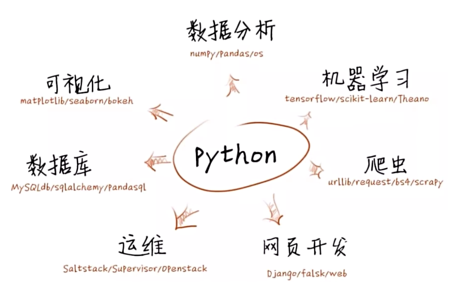

# basic



## 列表 
动态数组  可以放不同的数据类型
```python
list1 = ['physics', 'chemistry', 1997, 2000]
list2 = [1, 2, 3, 4, 5 ]
list3 = ["a", "b", "c", "d"]
```
## 元组
与列表相似  元素不能修改
```python
tup1 = ('physics', 'chemistry', 1997, 2000)
tup2 = (1, 2, 3, 4, 5 )
tup3 = "a", "b", "c", "d"
```

## 字典
```python
d = {key1 : value1, key2 : value2 }
```